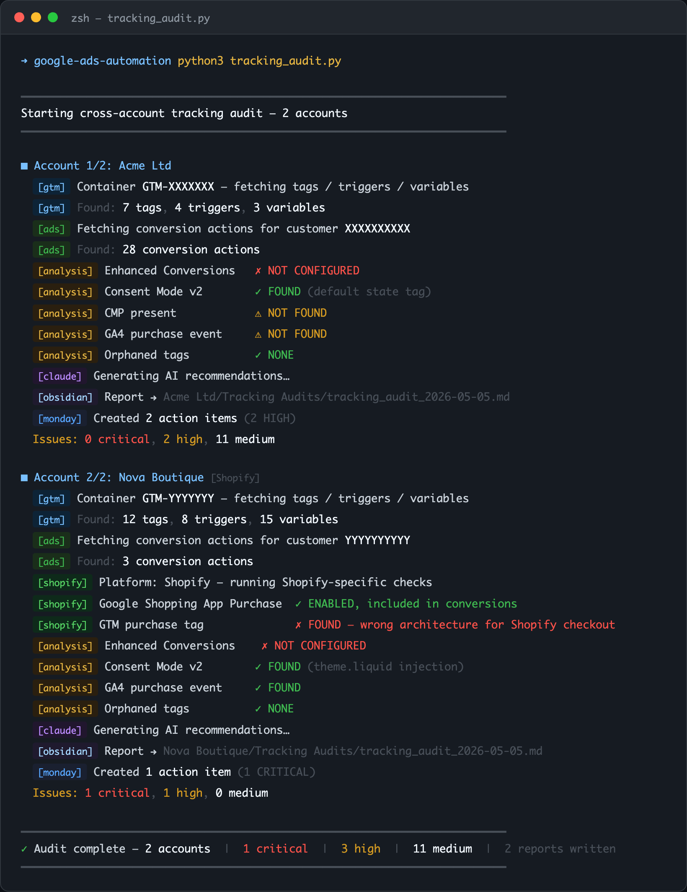
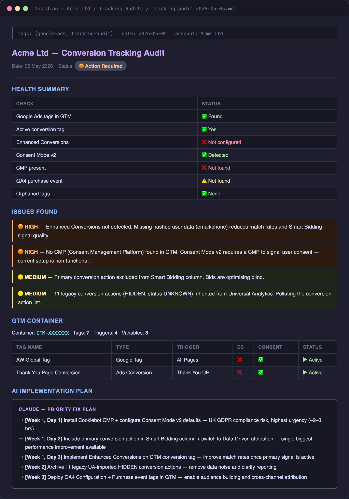
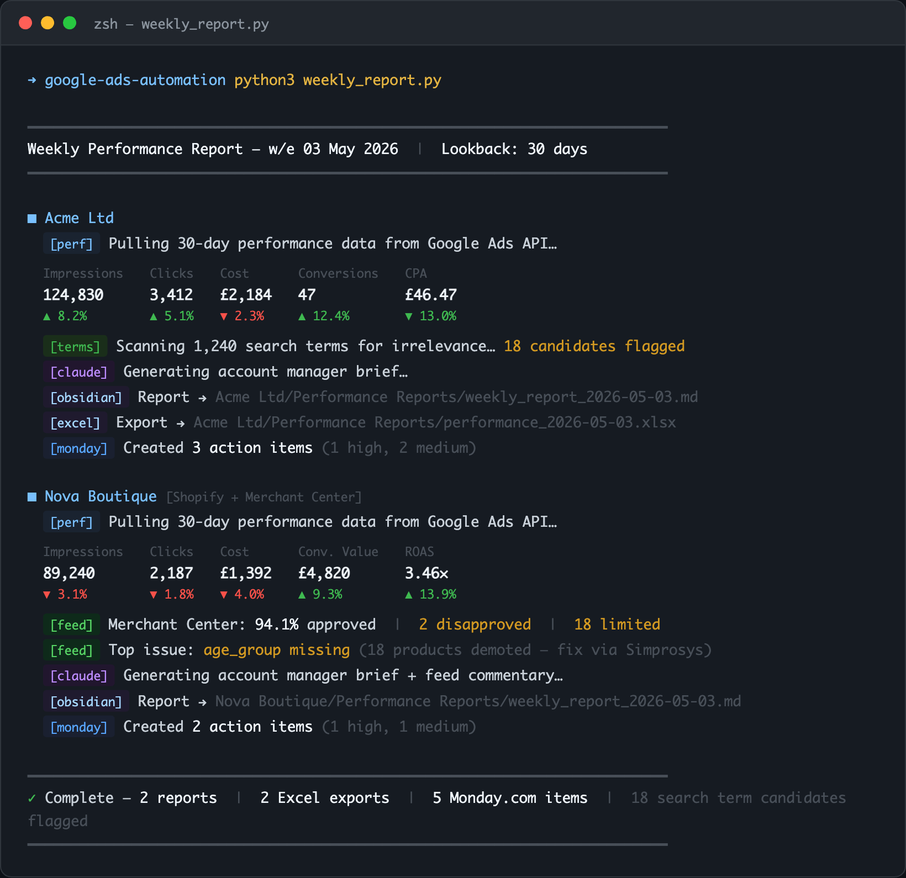
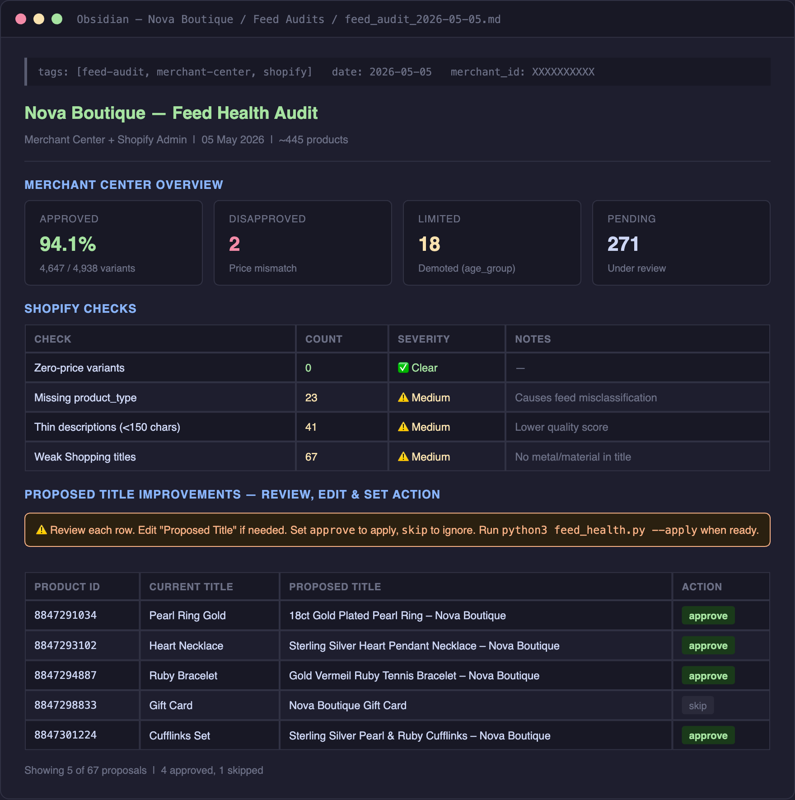

# Google Ads Automation Toolkit

End-to-end automation for Google Ads client management — tracking audits, feed optimisation, GA4 property setup, weekly performance reporting, and AI-generated recommendations. Built for agency and in-house PPC teams managing multiple accounts.

> **In production** across multiple live client accounts, managing ongoing spend and generating automated weekly reports, tracking audits, and feed health checks.

---

## Screenshots

| Tracking Audit | Obsidian Report |
|---|---|
|  |  |

| Weekly Report | Feed Health |
|---|---|
|  |  |

---

## What it does

Rather than a single monolithic tool, this is a suite of scripts that cover the full client management lifecycle — each runnable independently or chained together as part of a weekly workflow.

| Script | Purpose |
|---|---|
| `tracking_audit.py` | Cross-account GTM + Google Ads + GA4 health check with AI recommendations |
| `ga4_audit.py` | GA4 property audit and automated fixes (retention, attribution, conversions) |
| `feed_health.py` | Merchant Center + Shopify feed audit — approval rates, issues, fix proposals |
| `shopify_feed_optimiser.py` | AI-powered Shopping title and product_type optimisation via Shopify API |
| `deep_analysis.py` | Weekly account deep-dive — impression share, QS, PMax assets, device breakdown |
| `weekly_report.py` | Automated weekly performance report with AI account manager narrative |
| `search_term_optimiser.py` | Intent-based irrelevance detection across search terms, exports negative candidates |
| `gtm_ec_fix.py` | GTM Enhanced Conversions pipeline builder (capture → push → sequencing) |
| `gtm_consent_mode_setup.py` | Consent Mode v2 default state + CMP tag deployment via GTM API |
| `conversion_cleanup.py` | Conversion action status and attribution model management |
| `client_profile_update.py` | Automated client profile refresh in Obsidian knowledge base |
| `monday_helper.py` | Monday.com action item creation with deduplication |
| `obsidian_writer.py` | Shared library — branded Obsidian markdown + Excel report generation |

---

## APIs integrated

- **Google Ads API** — performance data, conversion actions, campaign structure
- **Google Tag Manager API** — tag/trigger/variable audit, programmatic workspace deployment
- **GA4 Admin API** — property settings, data streams, audience configuration, conversion import
- **Google Merchant Center API** — product approval rates, issue breakdown, feed diagnostics
- **Shopify Admin API** — product data reads and writes for feed optimisation
- **Monday.com API** — action item creation, deduplication, priority assignment
- **Anthropic Claude API** — AI synthesis layer for recommendations, narrative reports, intent detection

---

## Architecture

```
Weekly workflow
─────────────────────────────────────────────────────────────────────
Monday AM    deep_analysis.py     → Obsidian deep-dive + Monday items
             weekly_report.py     → Performance report + Excel export
             search_term_optimiser.py → Irrelevant term candidates

On demand    tracking_audit.py    → GTM + Ads + GA4 health check
             ga4_audit.py         → GA4 property audit (--audit / --apply)
             feed_health.py       → Feed audit + fix proposals
             shopify_feed_optimiser.py → AI title optimisation

Shared layers
─────────────────────────────────────────────────────────────────────
config.py           → Env vars, account config, Obsidian base path
obsidian_writer.py  → Branded markdown + Excel output (shared by all scripts)
monday_helper.py    → Monday.com action items (shared by all scripts)
```

**Output destinations:**
- Obsidian vault — dated Markdown reports per client per script
- Branded Excel files — performance data with applied design system
- Monday.com — action items with severity-based priority and due dates
- stdout — progress log for interactive runs

---

## Setup

### 1. Install dependencies

```bash
pip install -r requirements.txt
```

### 2. Configure credentials

Copy the example files and fill in your values:

```bash
cp .env.example .env
cp google-ads.yaml.example google-ads.yaml
```

**`.env`** — required variables:

```
ANTHROPIC_API_KEY=sk-ant-...
SHOPIFY_ACCESS_TOKEN=shpat_...
MONDAY_API_TOKEN=...
```

**`google-ads.yaml`** — Google Ads API credentials ([get a developer token](https://developers.google.com/google-ads/api/docs/get-started/dev-token)):

```yaml
developer_token: YOUR_DEVELOPER_TOKEN
client_id: YOUR_CLIENT_ID
client_secret: YOUR_CLIENT_SECRET
refresh_token: YOUR_REFRESH_TOKEN
login_customer_id: YOUR_MCC_ID
use_proto_plus: True
```

**GTM OAuth** — first run of any GTM script opens a browser for OAuth. Token is cached to `gtm_token.json` automatically.

### 3. Configure accounts

Edit `AUDIT_ACCOUNTS` in `tracking_audit.py`:

```python
AUDIT_ACCOUNTS = {
    "Client Name": {
        "gtm_container_public_id": "GTM-XXXXXXX",
        "ads_customer_id": "XXXXXXXXXX",  # no dashes
        "platform": "shopify",            # or "wordpress", "other"
    },
}
```

And `GA4_CLIENTS` in `ga4_audit.py` with the equivalent GA4 property details.

### 4. Set your Obsidian path

Update `OBSIDIAN_BASE` in `config.py` to your vault path:

```python
OBSIDIAN_BASE = "/path/to/your/obsidian/vault/Clients"
```

---

## Usage

### Tracking audit

```bash
python3 tracking_audit.py
```

Checks GTM containers, Google Ads conversion actions, Enhanced Conversions, Consent Mode v2, and GA4 purchase event coverage. Generates a severity-ranked issues list per account and posts action items to Monday.com.

**Shopify-specific checks included:**
- Verifies `Google Shopping App Purchase` conversion action (server-side, via Google & YouTube app)
- Flags any GTM purchase tags — wrong architecture for Shopify checkout sandbox
- Checks Conversion Linker presence
- Checks GA4 connection status via app

### GA4 audit

```bash
# Audit only — no changes
python3 ga4_audit.py --audit-only --client "Client Name"

# Audit + apply all API-fixable settings
python3 ga4_audit.py --apply --client "Client Name"
```

### Feed health

```bash
python3 feed_health.py
```

Pulls Merchant Center approval rates and issues breakdown, audits Shopify products for price mismatches, missing product_type, thin descriptions, and weak Shopping titles. AI analysis of top issues with platform-specific fix steps.

### Feed optimisation (AI title rewriting)

```bash
# Generate proposals
python3 shopify_feed_optimiser.py --propose

# Apply approved rows from the report
python3 shopify_feed_optimiser.py --apply
```

Generates AI-improved Shopping titles and infers missing product_type values. Writes editable proposal tables to Obsidian — you review and approve before any Shopify writes are made.

### Weekly performance report

```bash
python3 weekly_report.py
```

Pulls last N days of performance data (configurable via `LOOKBACK_DAYS`), generates an account manager brief with anomaly detection, and exports a branded Excel file.

### Search term optimiser

```bash
python3 search_term_optimiser.py
```

Uses Claude to identify irrelevant search terms by intent — not just keyword overlap. Exports negative keyword candidates per account for review.

---

## Key design decisions

**Audit-then-apply pattern** — scripts that make changes support `--audit-only` mode. Changes are never applied without explicit approval. This prevents automated scripts from making unreviewed modifications to live accounts.

**AI as analysis layer, not control layer** — Claude generates recommendations, summaries, and anomaly narratives. It does not make decisions about account changes. All writes go through reviewed code paths.

**Shared output library** — `obsidian_writer.py` provides a consistent branded output layer used by all scripts. Reports are uniform across accounts and script types.

**Monday.com deduplication** — `monday_helper.py` checks for existing open items before creating new ones, preventing duplicate action items from accumulating across weekly runs.

---

## Credential security

The following files contain credentials and are excluded by `.gitignore`. **Never commit them:**

- `.env` — API keys (Anthropic, Shopify, Monday.com)
- `google-ads.yaml` — Google Ads developer token + OAuth credentials
- `gtm_client.json` / `gtm_token.json` — GTM OAuth app + cached token
- `ga4_token.json` — GA4 OAuth token
- `merchant_token.json` — Merchant Center OAuth token

Use `.env.example` and `google-ads.yaml.example` as templates.

---

## Requirements

- Python 3.10+
- See `requirements.txt` for package dependencies
- Google Ads developer token (apply at [Google Ads API Center](https://developers.google.com/google-ads/api/docs/get-started/dev-token))
- Google Cloud project with Tag Manager API + Analytics Admin API enabled
- Shopify store with private app access token (Admin API scopes: `read_products`, `write_products`)
- Monday.com personal API token
- Anthropic API key

---

## License

MIT
